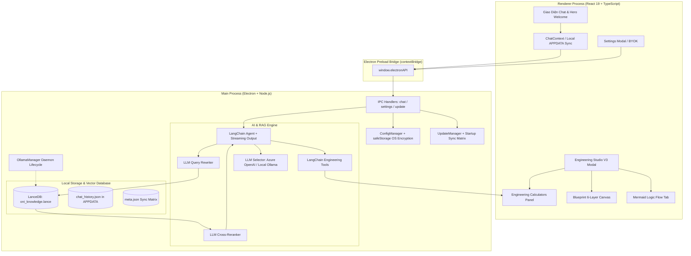

# 🚀 ONI Agent - Kỹ Sư Trưởng AI (Oxygen Not Included)

<div align="center">


<p align="center">
  <b>Hệ thống Trợ lý Trí tuệ Nhân tạo & Kỹ Sư Trưởng Toàn Năng cho tựa game mô phỏng sinh tồn Oxygen Not Included (Klei Entertainment).</b>
</p>

[Tính Năng Nổi Bật](#-tính-năng-nổi-bật) •
[Kiến Trúc Hệ Thống](#-kiến-trúc-hệ-thống) •
[Cài Đặt & Khởi Chạy](#-cài-đặt--khởi-chạy) •
[Hướng Dẫn Sử Dụng](#-hướng-dẫn-sử-dụng) •
[Tài Liệu Chi Tiết](#-tài-liệu-kỹ-thuật) •
[Lộ Trình Phát Triển](#-lộ-trình-phát-triển)

</div>

---

## 📖 Giới Thiệu Tổng Quan

**Oxygen Not Included (ONI)** là một trong những tựa game mô phỏng quản lý và sinh tồn phức tạp nhất, đòi hỏi người chơi phải nắm vững kiến thức về nhiệt động lực học, áp suất chất khí, thủy lực, hóa học, cơ điện tử và tự động hóa logic. 

**ONI Agent** được phát triển nhằm đóng vai trò như một **Kỹ Sư Trưởng AI (Chief Engineer Companion)** đồng hành cùng người chơi. Ứng dụng hoạt động theo kiến trúc **Local-First RAG (Retrieval-Augmented Generation)**, tích hợp cơ sở dữ liệu vector đĩa phẳng tốc độ cao, hỗ trợ tính toán công suất kỹ thuật, xuất sơ đồ phân lớp công trình (Blueprints) và tư vấn phương án thích ứng vật liệu cho căn cứ theo thời gian thực.

---

## ✨ Tính Năng Nổi Bật

### 🧠 1. Enterprise RAG Pipeline (Bộ Não AI & Tri Thức Chuyên Sâu)
- **LanceDB Flat-Disk Vector Store**: Cơ sở dữ liệu vector nhúng cục bộ tại `%APPDATA%/oni-agent/lancedb/`, triệt tiêu độ trễ mạng và loại bỏ hoàn toàn các lỗi thiếu bảng.
- **LLM Query Rewriter**: Tự động giải mã và mở rộng các từ khóa viết tắt kỹ thuật ONI (*SPOM, AT/ST, Hydra, Petroleum Boiler, Infinite Storage...*) thành chuỗi truy vấn giàu ngữ cảnh trước khi tìm kiếm vector.
- **LLM Cross-Reranker**: Truy xuất $k=25$ tài liệu ứng viên từ LanceDB và áp dụng LLM Cross-Reranker để chọn lọc ra 8 đoạn tri thức tinh hoa nhất cung cấp cho Prompt.
- **Multi-Turn Chat Context**: Tự động ghi nhớ và đưa lịch sử đối thoại gần nhất vào ngữ cảnh câu trả lời.

### ⚙️ 2. Multi-Provider LLM & Bảo Mật BYOK (Bring Your Own Key)
- **Chế độ Kép Linh Hoạt**:
  - 🟢 **Ollama Local (Miễn phí 100%)**: Tự động quản lý vòng đời daemon Ollama chạy ngầm, nạp mô hình vector embeddings `nomic-embed-text` và các LLM cục bộ (*Qwen2.5, Llama3.2, DeepSeek-R1*).
  - 🔵 **Azure AI Foundry / OpenAI (Enterprise BYOK)**: Kết nối với các mô hình Cloud LLM đỉnh cao (*GPT-5.3-Codex, GPT-4o*) qua endpoint cá nhân với thời gian phản hồi siêu tốc.
- **Mã Hóa safeStorage**: API Key cá nhân của người dùng được mã hóa bằng cơ chế bảo mật cấp hệ điều hành Windows (`safeStorage`) trước khi lưu xuống đĩa.

### 📐 3. ONI Engineering Studio V3 (Xưởng Kỹ Thuật & Bản Vẽ 6 Lớp)
- **Tab 1 - Calculators Panel**:
  - *SPOM Calculator*: Tính số máy điện phân, bơm Oxy/Hydro, lượng nước cấp và cân bằng điện tự cấp (Self-Powered).
  - *AT/ST Cooling Calculator*: Tính số máy Aquatuner & Steam Turbine cần thiết dựa trên chất làm mát (Polluted Water, Super Coolant, Naphtha...) và tải nhiệt kDTU/s.
  - *Food & Agriculture Calculator*: Tính toán số lượng cây trồng/vật nuôi và tài nguyên duy trì cho $N$ Duplicants.
  - *Geyser & Volcano Pipeline Balancer*: Tính sản lượng trung bình và thiết bị hạ nguồn cho mạch nước/núi lửa.
- **Tab 2 - Blueprint 6-Layer Canvas**: Canvas tương tác chuyển đổi linh hoạt 6 lớp Overlay trong ONI (*Building, Liquid, Gas, Power, Automation, Shipping*) và chế độ đè lớp *Composite Mode*.
- **Tab 3 - Mermaid Logic Flow**: Trực quan hóa sơ đồ luồng Mermaid phân tách theo từng hệ thống cơ điện lạnh.
- **Tab 4 - Adaptive Material Guide**: Bảng khuyến nghị thay thế vật liệu (*Material Swap Table*) và đánh giá ngưỡng quá nhiệt, dẫn nhiệt, nhiệt dung riêng.

### 🔄 4. Startup Knowledge Sync Matrix & Offline Data Guard
- **Ma Trận Đồng Bộ Thông Minh**:
  - *Custom Guides (`data/custom_guides/`)*: So sánh mã MD5 Hash của từng file Markdown.
  - *Wiki.gg*: Theo dõi biến động số lượng chỉnh sửa MediaWiki API `last_edits_count` (hơn 71,000 edits).
  - *Steam Community Guides & ONI-DB*: Đồng bộ định kỳ theo chu kỳ 30 ngày và 60 ngày.
- **Offline / Cellular Data Guard**: Tùy chọn khóa 100% kết nối cào mạng ngoài khi sử dụng mạng di động/băng thông giới hạn.

---

## 🏗️ Kiến Trúc Hệ Thống



---

## 🛠️ Công Nghệ Sử Dụng (Tech Stack)

| Thành Phần | Công Nghệ / Thư Viện | Vai Trò |
| :--- | :--- | :--- |
| **Lõi Desktop** | Electron 43.1.1, Node.js | Môi trường ứng dụng đa nền tảng, quản lý tiến trình con |
| **Giao Diện (Frontend)** | React 19, TypeScript, Vite 8, Sass (SCSS Modules) | Giao diện tương tác người dùng, hiệu ứng Glassmorphism |
| **Quản Lý Trạng Thái** | React Context (ChatContext, ThemeContext) | Đồng bộ trạng thái Single Source of Truth |
| **Vector Database** | `@lancedb/lancedb` 0.31.0, `apache-arrow` | Lưu trữ và tìm kiếm vector đĩa phẳng hiệu năng cao |
| **AI Framework** | LangChain.js (`@langchain/core`, `@langchain/openai`, `@langchain/ollama`) | Điều phối chuỗi RAG, Tool Calling, Prompt Chains |
| **Embeddings & LLM** | Ollama (`nomic-embed-text`), Azure OpenAI (`gpt-5.3-codex`) | Trích xuất đặc trưng vector và suy luận ngôn ngữ tự nhiên |
| **Cào Dữ Liệu (Crawler)** | `cheerio`, `jsdom`, `puppeteer-core` | Bóc tách HTML từ Wiki.gg, Steam Guides và ONI-DB |
| **Trình Diễn & Biểu Đồ** | `react-markdown`, `remark-gfm`, `mermaid` 11.16 | Hiển thị bảng Markdown, sơ đồ luồng Mermaid |
| **Bảo Mật & Quản Trị** | Electron `safeStorage`, `crypto` MD5, `adm-zip` | Mã hóa API Key, tính hash dữ liệu, cài đặt tự động binary |

---

## 📦 Cài Đặt & Khởi Chạy

### Yêu Cầu Tiên Quyết
- **Hệ điều hành**: Windows 10/11 (64-bit).
- **Node.js**: Phiên bản `18.x` hoặc `20.x` trở lên.
- **Trình quản lý gói**: `npm` hoặc `yarn`.

### Các Bước Cài Đặt

1. **Clone repository về máy**:
   ```bash
   git clone https://github.com/Luxaztk/ONI-agent.git
   cd ONI-agent
   ```

2. **Cài đặt các gói phụ thuộc (Dependencies)**:
   ```bash
   npm install
   ```

3. **Cấu hình biến môi trường (Tùy chọn)**:
   Sao chép file `.env.example` thành `.env`:
   ```bash
   cp .env.example .env
   ```
   *Lưu ý: Bạn cũng có thể cấu hình trực tiếp Azure API Key thông qua giao diện **Cài Đặt AI Engine** bên trong ứng dụng.*

4. **Khởi chạy môi trường phát triển (Development Mode)**:
   ```bash
   npm run dev
   ```
   *Ứng dụng sẽ tự động khởi tạo cửa sổ Electron, kiểm tra/tải daemon Ollama, nạp model `nomic-embed-text` và kết nối cơ sở dữ liệu LanceDB.*

---

## 📜 Các Lệnh Scripts Có Sẵn

```bash
# Khởi chạy ứng dụng ở chế độ Development (HMR)
npm run dev

# Kiểm tra kiểu dữ liệu TypeScript và build bundle
npm run build

# Đóng gói ứng dụng thành thư mục thực thi không cần cài đặt
npm run pack

# Đóng gói bộ cài đặt Windows chuyên nghiệp (.exe NSIS Installer)
npm run dist

# Kiểm tra chất lượng mã nguồn bằng Oxlint
npm run lint

# Chạy worker cào dữ liệu thủ công
npm run ingest

# Di chuyển dữ liệu vector JSON cũ sang LanceDB
npm run migrate
```

---

## 🎯 Hướng Dẫn Sử Dụng

1. **Bắt đầu cuộc trò chuyện**:
   - Sử dụng các thẻ câu hỏi gợi ý nhanh (*Vòng lặp làm mát AT/ST, SPOM Tự Cấp Điện, Petroleum Boiler, Bẫy Lưu Trữ Vô Hạn*) hoặc nhập câu hỏi kỹ thuật trực tiếp vào khung chat nổi.
2. **Sử dụng ONI Engineering Studio V3**:
   - Nhấn nút **Engineering Studio V3** màu Cyan phát sáng ở thanh bên trái (Sidebar).
   - Sử dụng các tab **Calculators**, **Blueprint Canvas (6 lớp)**, **Mermaid Logic Flow**, hoặc **Adaptive Material Guide** để tính toán và thiết kế hệ thống.
   - Nhấn nút **Gửi thông số vào Chat** để chuyển kết quả tính toán sang cho Kỹ Sư Trưởng AI phân tích chuyên sâu.
3. **Cập nhật tri thức cơ sở dữ liệu**:
   - Nhấn nút **Cập nhật Tri thức** ở thanh Sidebar để quét kiểm tra dữ liệu thay đổi từ Wiki.gg, Steam Guides và Custom Guides.
4. **Cấu hình AI Engine**:
   - Nhấn **Cài đặt AI Engine** để lựa chọn giữa *Ollama Local* hoặc *Azure AI Foundry (BYOK)*, kiểm tra kết nối với nút **Kiểm tra kết nối** và lưu cấu hình an toàn.

---

## 📚 Tài Liệu Kỹ Thuật

Để tìm hiểu chi tiết về luồng dữ liệu, phân tích mã nguồn và các công thức toán học/vật lý được triển khai, vui lòng xem các tài liệu chuyên sâu trong thư mục `docs/`:

- 📘 [Báo Cáo Phân Tích Kiến Trúc & Vận Hành Hệ Thống (`docs/ARCHITECTURE_AND_OPERATION.md`)](file:///k:/ONI-agent/docs/ARCHITECTURE_AND_OPERATION.md)
- 🎯 [Tổng Hợp 8 Kịch Bản Sử Dụng Thực Tế (`docs/USE_CASES.md`)](file:///k:/ONI-agent/docs/USE_CASES.md)
- 🗺️ [Lộ Trình Phát Triển Chi Tiết 10 Phase (`docs/ROADMAP.md`)](file:///k:/ONI-agent/docs/ROADMAP.md)

---

## 🗺️ Lộ Trình Phát Triển (Roadmap)

- [x] **Phase 1 - 4**: Tái cấu trúc sang Electron + TypeScript + LanceDB + Ollama Daemon + Azure Foundry BYOK.
- [x] **Phase 5**: Mở rộng Wiki/Steam Crawler, Custom Guides và Enterprise RAG Pipeline (Query Rewriter + Reranker).
- [x] **Phase 6**: Giao diện Cài đặt LLM, mã hóa safeStorage và Offline Data Guard.
- [x] **Phase 7**: ONI Engineering Studio V3 (Calculators Panel, Blueprint 6-Layer Canvas, Mermaid Diagrams, Adaptive Guides).
- [ ] **Phase 8**: Vision Debugger Agent (Nhận diện lỗi đường ống/dây điện qua ảnh chụp màn hình).
- [ ] **Phase 9**: Real-time Telemetry Agent (C# Harmony Mod đọc dữ liệu sống còn và cảnh báo nguy cơ thảm họa).
- [ ] **Phase 10**: Autonomous Blueprint Agent (C# Harmony Bridge tự động đặt bóng công trình trực tiếp trong game).

---

## 📄 Bản Quyền & Giấy Phép

Dự án được phân phối dưới giấy phép nguồn mở. Mọi thông số kỹ thuật và hình ảnh game thuộc quyền sở hữu của [Klei Entertainment](https://www.klei.com/).
