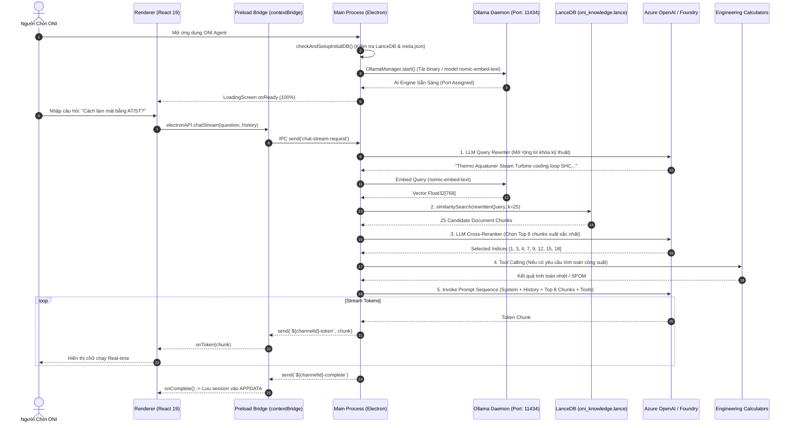
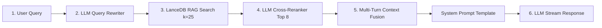
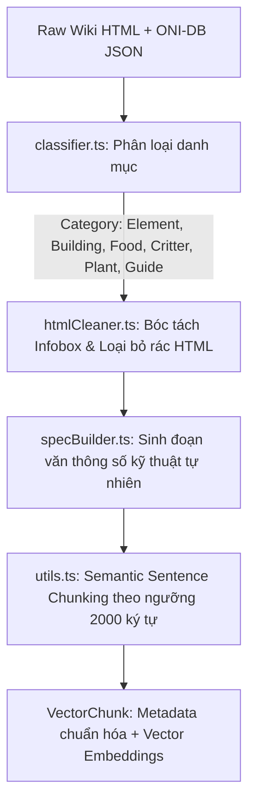
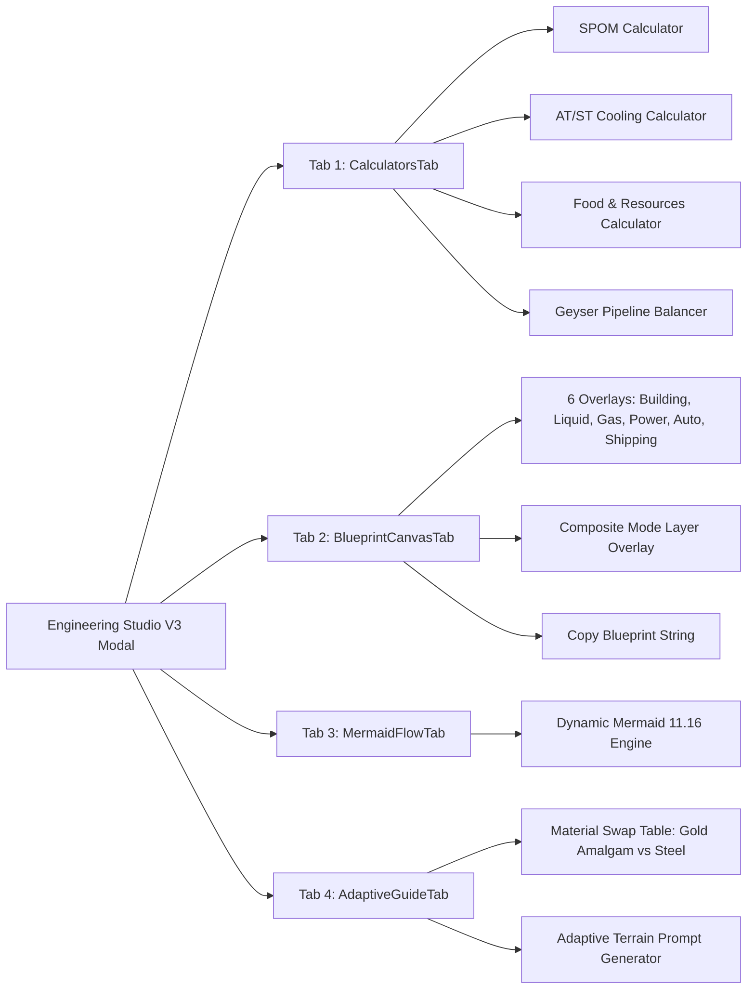

# 🏛️ Báo Cáo Kỹ Thuật: Kiến Trúc & Cơ Chế Vận Hành Hệ Thống ONI Agent

> **Phiên bản tài liệu**: 1.2.0  
> **Dự án**: ONI Agent (Oxygen Not Included AI Engineering Companion)  
> **Tác giả / Nhóm phát triển**: ONI Agent Core Team  
> **Mục tiêu**: Phân tích chuyên sâu kiến trúc mã nguồn, luồng dữ liệu (Data Flow), chu trình RAG Pipeline, cơ chế quản lý daemon Ollama, ma trận đồng bộ tri thức và các công thức vật lý kỹ thuật trong game.

---

## 📑 Mục Lục
1. [Tổng Quan Kiến Trúc & Triết Lý Thiết Kế](#1-tổng-quan-kiến-trúc--triết-lý-thiết-kế)
2. [Sơ Đồ Luồng Hoạt Động Toàn Cục (System Architecture Diagram)](#2-sơ-đồ-luồng-hoạt-động-toàn-cục)
3. [Phân Tích Chi Tiết Electron Main Process & Bộ Não AI](#3-phân-tích-chi-tiết-electron-main-process--bộ-não-ai)
   - 3.1. Quản lý vòng đời Daemon Ollama (`OllamaManager.ts`)
   - 3.2. Cấu hình & Bảo mật đa tầng BYOK (`configManager.ts`)
   - 3.3. Enterprise RAG Pipeline 5 giai đoạn (`agent.ts`, `queryRewriter.ts`, `reranker.ts`)
   - 3.4. Hệ thống LangChain Dynamic Tools (`tools/index.ts`)
4. [Cơ Chế Thu Thập & Xử Lý Tri Thức Đa Hình](#4-cơ-chế-thu-thập--xử-lý-tri-thức-đa-hình)
   - 4.1. Hệ thống Crawlers phân tán (`wikiCrawler`, `oniDbCrawler`, `steamCrawler`)
   - 4.2. Bộ xử lý đa hình & Semantic Chunking (`processor/`)
   - 4.3. Ma trận đồng bộ khởi động (`UpdateManager.ts` & Startup Sync Matrix)
5. [Kiến Trúc Renderer Process & Trải Nghiệm Người Dùng](#5-kiến-trúc-renderer-process--trải-nghiệm-người-dùng)
   - 5.1. Quản lý trạng thái & Single Source of Truth (`ChatContext.tsx`)
   - 5.2. Trình diễn Markdown & Khung mã nguồn (`MessageItem.tsx`)
   - 5.3. Xưởng Kỹ Thuật & Bản Vẽ ONI Engineering Studio V3
6. [Cơ Sở Toán Học & Vật Lý Trong ONI Calculators](#6-cơ-sở-toán-học--vật-lý-trong-oni-calculators)
   - 6.1. Phương trình cân bằng SPOM (Self-Powered Oxygen Module)
   - 6.2. Phương trình nhiệt động lực học AT/ST Cooling
   - 6.3. Mô hình tính toán Nông nghiệp & Cân bằng Geyser
7. [Bảo Mật, Tối Ưu Hóa & Đóng Gói Ứng Dụng](#7-bảo-mật-tối-ưu-hóa--đóng-gói-ứng-dụng)
8. [Định Hướng Mở Rộng Tiếp Theo (Roadmap Phase 8 - 10)](#8-định-hướng-mở-rộng-tiếp-theo)

---

## 1. Tổng Quan Kiến Trúc & Triết Lý Thiết Kế

### 1.1 Bối Cảnh Kỹ Thuật
Trong game *Oxygen Not Included*, người chơi phải thường xuyên tính toán các hệ thống cân bằng phức tạp:
- **Nhiệt dung riêng (Specific Heat Capacity - SHC)** và điểm chuyển pha của chất làm mát.
- **Tỉ lệ sinh khối & áp suất khí**: Tách lọc Oxy và Hydro mà không làm ngập áp suất máy điện phân.
- **Xung đột Overlay**: Một bản thiết kế công nghiệp tiêu chuẩn yêu cầu đồng thời 6 lớp bản vẽ (Kiến trúc, Nước, Khí, Điện, Tự động hóa, Băng chuyền).

**ONI Agent** được xây dựng nhằm giải quyết các thách thức trên bằng mô hình **Local-First Desktop AI Application**.

### 1.2 Triết Lý Thiết Kế Cốt Lõi
1. **Zero Network Latency for Vectors**: Toàn bộ kho tri thức vector (1,927+ chunks) được lưu trữ trực tiếp trên đĩa phẳng thông qua **LanceDB**, không phụ thuộc vào kết nối mạng bên ngoài để tìm kiếm tri thức.
2. **Dual AI Mode (Offline Local & Enterprise Cloud)**: Hỗ trợ người dùng hoàn toàn miễn phí thông qua **Ollama Local** (`nomic-embed-text`) hoặc nâng cao với **Azure AI Foundry / OpenAI** (`gpt-5.3-codex`).
3. **Strict Process Lifecycle Management**: Diệt sạch tiến trình con và nhả tài nguyên GPU/CUDA DLL khi tắt ứng dụng, ngăn chặn hiện tượng rò rỉ bộ nhớ (Memory Leak) hoặc khóa file (EBUSY).
4. **Multi-Layer Engineering Studio**: Không chỉ trả lời bằng văn bản thuần túy, ứng dụng cung cấp giao diện tương tác trực quan 2D và sơ đồ luồng Mermaid phân lớp.

---

## 2. Sơ Đồ Luồng Hoạt Động Toàn Cục

Sơ đồ dưới đây mô tả chi tiết toàn bộ chu trình xử lý từ khi người dùng khởi động ứng dụng cho đến khi nhận được kết quả phản hồi Streaming:



---

## 3. Phân Tích Chi Tiết Electron Main Process & Bộ Não AI

### 3.1 Quản Lý Vòng Đời Daemon Ollama (`OllamaManager.ts`)

File mã nguồn: [`electron/modules/ai/OllamaManager.ts`](file:///k:/ONI-agent/electron/modules/ai/OllamaManager.ts)

Module `OllamaManager` chịu trách nhiệm toàn diện về việc cài đặt, khởi tạo và giám sát tiến trình con Ollama trên hệ thống của người dùng:

1. **Dọn dẹp tiến trình xung đột (Process Tree Cleanup)**:
   - Trước khi khởi động hoặc giải nén, hàm `killExistingProcess()` thực thi:
     ```typescript
     execSync('taskkill /F /IM ollama.exe /T 2>nul', { stdio: 'ignore' });
     ```
   - Lệnh này đảm bảo toàn bộ cây tiến trình con của Ollama bị tiêu diệt sạch sẽ, giải phóng hoàn toàn khóa tệp DLL đồ họa CUDA (`cublas64_13.dll`, `cudart64_12.dll`).

2. **Cơ chế Tự Động Tải Binary Thông Minh**:
   - Nếu chưa tồn tại `ollama.exe` trong `%APPDATA%/oni-agent/bin/`, ứng dụng tự động tải bản phát hành mới nhất từ GitHub (`ollama-windows-amd64.zip`) qua HTTP stream có báo tiến độ phần trăm (`onProgress`).
   - Sử dụng `AdmZip` giải nén với cờ `overwrite = false` để tránh lỗi `EBUSY` nếu có tiến trình khác đang đọc file.

3. **Cơ Chế Phân Bổ Port Động**:
   - Hàm `findFreePort()` sử dụng `net.createServer().listen(0)` để tìm kiếm cổng mạng khả dụng ngẫu nhiên (mặc định ưu tiên 11434), sau đó truyền cổng này vào biến môi trường `OLLAMA_HOST` và `process.env.OLLAMA_API_PORT`.

4. **Tự Động Nạp Model Embeddings**:
   - Tự động gọi API `POST /api/pull` để tải mô hình `nomic-embed-text` vào `%APPDATA%/oni-agent/models/`. Quá trình nạp được phân tích cú pháp stream JSON để cập nhật thanh tiến trình trên `LoadingScreen`.

5. **Giải phóng an toàn khi đóng App**:
   - Đăng ký lắng nghe các sự kiện `before-quit`, `will-quit`, và `window-all-closed` trong `main.ts` để gọi `OllamaManager.stop()`, gửi tín hiệu `taskkill /F /T /PID` dọn dẹp sạch tiến trình.

---

### 3.2 Cấu Hình & Bảo Mật Đa Tầng BYOK (`configManager.ts`)

File mã nguồn: [`electron/modules/config/configManager.ts`](file:///k:/ONI-agent/electron/modules/config/configManager.ts)

Ứng dụng triển khai mô hình **BYOK (Bring Your Own Key)** cho phép người dùng tự nhập API Key của Microsoft Azure AI Foundry hoặc Azure OpenAI cá nhân:

```typescript
export interface AIConfig {
  provider: 'ollama' | 'azure';
  offlineMode?: boolean;
  azure: {
    endpoint: string;
    apiKey: string;
    modelName: string;
    apiVersion: string;
  };
  ollama: {
    port: number;
    model: string;
  };
}
```

#### Cơ chế Mã Hóa `safeStorage`:
- **Ghi dữ liệu (`encryptKey`)**: Nếu môi trường Electron hỗ trợ `safeStorage.isEncryptionAvailable()`, API Key dạng plaintext sẽ được mã hóa bằng khóa bảo mật cục bộ của Windows Data Protection API (DPAPI) và lưu vào file dưới dạng chuỗi tiền tố `enc:<base64>`.
- **Đọc dữ liệu (`decryptKey`)**: Khi nạp cấu hình, chuỗi `enc:...` được giải mã ngược lại thành plaintext chỉ trong bộ nhớ RAM của Main Process.
- **Renderer Shielding (`getMaskedConfig`)**: Khi gửi cấu hình sang giao diện Renderer (qua IPC `get-settings`), API Key luôn được che giấu dưới dạng `sk-a1...9b2c` hoặc `••••••••`, ngăn chặn việc lộ key qua DevTools.

---

### 3.3 Enterprise RAG Pipeline 5 Giai Đoạn

File mã nguồn: [`electron/modules/ai/agent.ts`](file:///k:/ONI-agent/electron/modules/ai/agent.ts)



1. **Giai đoạn 1: LLM Query Rewriter ([`queryRewriter.ts`](file:///k:/ONI-agent/electron/modules/ai/queryRewriter.ts))**:
   - Người chơi game thường dùng từ viết tắt ngắn gọn: *"Xây SPOM sao?", "Tính AT/ST", "Bẫy nén khí"*.
   - Query Rewriter sử dụng mô hình LLM giải mã toàn bộ thuật ngữ chuyên ngành ONI:
     $$\text{Query: "SPOM"} \xrightarrow{\text{Rewriter}} \text{"Self-Powering Oxygen Module Electrolyzer Hydrogen Generator Gas Pump"}$$
2. **Giai đoạn 2: LanceDB Similarity Search ([`vectorDb.ts`](file:///k:/ONI-agent/electron/infrastructure/vectorDb.ts))**:
   - Truy vấn vector `nomic-embed-text` (768 chiều) trên bảng `oni_knowledge.lance` để lấy ra $k=25$ chunks tài liệu có độ tương đồng cosine cao nhất.
3. **Giai đoạn 3: LLM Cross-Reranker ([`reranker.ts`](file:///k:/ONI-agent/electron/modules/ai/reranker.ts))**:
   - Dùng Prompt chấm điểm để LLM đóng vai trò Cross-Encoder, đọc lướt 25 ứng viên và chọn ra danh sách 8 chỉ số đoạn văn bản then chốt nhất.
4. **Giai đoạn 4: Hợp Nhất Ngữ Cảnh Multi-Turn (Multi-Turn History Fusion)**:
   - Trích xuất 6 tin nhắn gần nhất từ phiên trò chuyện hiện tại, định dạng thành khối `--- LỊCH SỬ TRÒ CHUYỆN GẦN ĐÂY ---` chèn vào ngữ cảnh Prompt.
5. **Giai đoạn 5: Streaming Execution**:
   - Sử dụng `RunnableSequence` của LangChain kết hợp với `StringOutputParser` để stream từng token văn bản về cửa sổ giao diện thông qua kênh IPC Renderer chuyên biệt `chat-${Date.now()}`.

---

### 3.4 Hệ Thống LangChain Dynamic Tools (`tools/index.ts`)

File mã nguồn: [`electron/modules/ai/tools/index.ts`](file:///k:/ONI-agent/electron/modules/ai/tools/index.ts)

AI Agent được trang bị 5 công cụ nội bộ (Internal Dynamic Tools):
1. `recipe_lookup`: Tra cứu điểm nóng chảy, nhiệt dung riêng (SHC) và độ dẫn nhiệt của các chất liệu trong `data/oni_materials.json`.
2. `oni_calculator`: Kết nối trực tiếp với bộ tính toán kỹ thuật để giải quyết các bài toán SPOM cho $N$ Duplicants hoặc cân bằng nhiệt độ Aquatuner/Steam Turbine.
3. `blueprint_search`: Tra cứu kho 50+ bản thiết kế Master Blueprints theo từ khóa và danh mục.
4. `blueprint_render`: Xuất mã nguồn sơ đồ luồng Mermaid phân tách 6 lớp cho một bản vẽ cụ thể.
5. `vector_search`: Tìm kiếm sâu các bài viết hướng dẫn trong cơ sở dữ liệu LanceDB.

---

## 4. Cơ Chế Thu Thập & Xử Lý Tri Thức Đa Hình

### 4.1 Hệ Thống Crawlers Phân Tán

Thư mục mã nguồn: [`electron/modules/ai/crawler/`](file:///k:/ONI-agent/electron/modules/ai/crawler/)

Hệ thống crawler được chia thành 4 phân hệ chuyên biệt:
- **`wikiCrawler.ts`**: Quét 16 danh mục cốt lõi trên `oxygennotincluded.wiki.gg` (*Category:Guides, Building, Geysers, Elements, Duplicant, Critters, Disease, Skills, Equipment, Food, Category:Research, Biome, Resource, Asteroid_Types, Planetoid_Clusters*). Tự động theo dõi các trang chuyển hướng (Redirects) và trang thảo luận.
- **`oniDbCrawler.ts`**: Cào toàn bộ cây dữ liệu cấu trúc kỹ thuật (chỉ số cơ điện lạnh, công thức chế tạo) từ trang cơ sở dữ liệu `oni-db.com`.
- **`steamCrawler.ts`**: Sử dụng `jsdom` và `cheerio` để bóc tách các bài hướng dẫn huyền thoại trên Steam Community (*The Compendium of Amazing Designs của tác giả Jahws*), tách từng phân đoạn `.subSectionTitle` & `.subSectionText` thành các tài liệu độc lập.
- **`puppeteerCrawler.ts`**: Tận dụng lõi Chromium có sẵn của Electron để cào các trang web có nội dung render bằng Client-side JavaScript.

---

### 4.2 Bộ Xử Lý Đa Hình & Semantic Chunking

Thư mục mã nguồn: [`electron/modules/ai/processor/`](file:///k:/ONI-agent/electron/modules/ai/processor/)

Module `processor` thực hiện làm sạch và chuẩn hóa dữ liệu theo cơ chế đa hình (Polymorphism):



- **`classifier.ts`**: Nhận diện loại thực thể dựa trên cấu trúc DOM và từ khóa (ví dụ: phát hiện `Infobox element` -> loại `element`, phát hiện `Infobox building` -> loại `building`).
- **`htmlCleaner.ts`**: Loại bỏ toàn bộ thẻ rác (`<script>`, `<style>`, `<nav>`, class quảng cáo, bảng điều hướng) và trích xuất bảng Infobox thành cặp Key-Value có cấu trúc.
- **`specBuilder.ts`**: Tự động tổng hợp thông số kỹ thuật khô khan thành các câu văn xuôi giàu ngữ nghĩa phục vụ tối ưu cho Vector Search:
  > *"Natural Gas is a element in Oxygen Not Included. State: Gas. Specific Heat Capacity: 2.191 DTU/(g·°C). Thermal Conductivity: 0.024 W/(m·K)..."*

---

### 4.3 Ma Trận Đồng Bộ Khởi Động (`UpdateManager.ts`)

File mã nguồn: [`electron/modules/ai/updateManager.ts`](file:///k:/ONI-agent/electron/modules/ai/updateManager.ts)

Để tránh tình trạng cào lại toàn bộ dữ liệu mạng mỗi khi khởi động ứng dụng (gây lãng phí băng thông và chậm máy), `UpdateManager` sử dụng **Ma Trận Đồng Bộ Nguồn (Startup Sync Matrix)** lưu trữ trong file `%APPDATA%/oni-agent/meta.json`:

```json
{
  "last_sync_timestamp": 1741054800000,
  "sources": {
    "custom_guides": {
      "last_updated": 1741054800000,
      "file_hashes": {
        "at_st_cooling_system.md": "a1b2c3d4e5f6...",
        "spom_rodriguez_setup.md": "7890abcdef12..."
      }
    },
    "steam_guides": { "last_updated": 1741054800000 },
    "wiki_gg": { "last_updated": 1741054800000, "last_edits_count": 71194 },
    "oni_db": { "last_updated": 1741054800000 }
  }
}
```

#### Thuật Toán Kiểm Tra Cập Nhật:
1. **Custom Guides**: Tính toán mã MD5 Hash của từng file Markdown trong `data/custom_guides/`. Nếu phát hiện mã hash thay đổi $\to$ Chỉ nạp bổ sung (Incremental Ingest) đúng file bị sửa.
2. **Wiki.gg**: Gọi API MediaWiki `api.php?action=query&meta=siteinfo&siprop=statistics` để lấy tổng số lượt chỉnh sửa (`edits`). Chỉ kích hoạt cào lại khi số lượt sửa đổi vượt ngưỡng chênh lệch $\Delta \text{edits} > 500$.
3. **Steam Guides & ONI-DB**: Kiểm tra chu kỳ thời gian quá hạn $\Delta t > 30\text{ ngày}$ (Steam) hoặc $\Delta t > 60\text{ ngày}$ (ONI-DB).
4. **Offline Guard**: Nếu cờ `offlineMode: true` được kích hoạt, hệ thống sẽ bỏ qua 100% các yêu cầu kiểm tra mạng ngoài.

---

## 5. Kiến Trúc Renderer Process & Trải Nghiệm Người Dùng

### 5.1 Quản Lý Trạng Thái Single Source of Truth (`ChatContext.tsx`)

File mã nguồn: [`src/context/ChatContext.tsx`](file:///k:/ONI-agent/src/context/ChatContext.tsx)

- **Lưu trữ Vĩnh Cửu**: Thay vì sử dụng `localStorage` (bị giới hạn dung lượng 5MB và dễ bị trình duyệt xóa), `ChatContext` lưu trữ toàn bộ các phiên trò chuyện trực tiếp vào file hệ điều hành `%APPDATA%/oni-agent/chat_history.json` thông qua IPC `save-chat-sessions`.
- **Triệt tiêu Race Condition & Duplication**: Sử dụng cặp `useRef` song song (`sessionsRef`, `currentSessionIdRef`) để quản lý ID phiên trò chuyện duy nhất, loại bỏ hoàn toàn lỗi tạo trùng lặp 2 phiên chat khi người dùng gửi tin nhắn đầu tiên.

---

### 5.2 Trình Diễn Markdown & Khung Mã Nguồn (`MessageItem.tsx`)

File mã nguồn: [`src/components/MessageItem/MessageItem.tsx`](file:///k:/ONI-agent/src/components/MessageItem/MessageItem.tsx)

- Tích hợp `react-markdown` và plugin `remark-gfm`.
- **Tự Động Bọc Khung Code Block**: Bắt các khối mã nguồn và bản vẽ chuỗi, hiển thị thanh tiêu đề ngôn ngữ kèm nút **Sao Chép (Copy Code Button)** với hiệu ứng chuyển đổi trạng thái mượt mà (1-touch copy).
- **Trình Diễn Bảng Thông Số Kỹ Thuật (Table Wrapper)**: Tự động bọc bảng thông số vào `div.tableWrapper` với thanh cuộn ẩn tinh tế và viền phát sáng Glassmorphism.

---

### 5.3 Xưởng Kỹ Thuật & Bản Vẽ ONI Engineering Studio V3

Thư mục mã nguồn: [`src/components/EngineeringStudio/`](file:///k:/ONI-agent/src/components/EngineeringStudio/)

Giao diện Studio được cấu trúc thành 4 Tab chuyên sâu:



1. **`CalculatorsTab.tsx`**: Cung cấp giao diện thanh trượt (Sliders) và bộ nhập số liệu kỹ thuật, tự động tính toán các thông số cân bằng theo thời gian thực và cung cấp nút **"Gửi vào Chat"** để AI phân tích tiếp.
2. **`BlueprintCanvasTab.tsx`**: Vẽ trực tiếp sơ đồ bản thiết kế 2D trên HTML Canvas với khả năng bật tắt độc lập từng lớp trong 6 Overlays ONI:
   - 🏢 **Building Layer**: Vị trí máy móc, kích thước $(w \times h)$, vật liệu chính.
   - 🔵 **Liquid Layer (Plumbing)**: Ống nước thường, ống cách nhiệt, hướng dòng chảy.
   - 🟢 **Gas Layer (Ventilation)**: Ống dẫn khí Oxy, Hydro, CO2.
   - 🟡 **Power Layer (Electrical Grid)**: Dây dẫn thường (1kW), Dây dẫn lớn (20kW Heavy-Watt Wire), Pin thông minh.
   - 🔴 **Automation Layer (Logic Grid)**: Dây tín hiệu Logic, Cảm biến áp suất khí (Atmo Sensor), Cảm biến nhiệt (Thermo Sensor).
   - 📦 **Shipping Layer (Conveyor)**: Băng chuyền tự động hóa, Tay gắp tự động (Auto-Sweeper), Máy nạp băng chuyền.
3. **`MermaidFlowTab.tsx`**: Khởi tạo engine `mermaid.run()` hiển thị sơ đồ khối logic rõ ràng cho từng lớp công trình.
4. **`AdaptiveGuideTab.tsx`**: Cung cấp ma trận đánh giá rủi ro khi thay thế vật liệu công trình (ví dụ: chuyển từ Gold Amalgam sang Steel tăng ngưỡng chịu nhiệt $+200^\circ\text{C}$).

---

## 6. Cơ Sở Toán Học & Vật Lý Trong ONI Calculators

File mã nguồn: [`src/utils/oniCalculators.ts`](file:///k:/ONI-agent/src/utils/oniCalculators.ts)

Toàn bộ các module tính toán trong ONI Agent đều được xây dựng dựa trên các phương trình cơ học chất lưu và nhiệt động lực học chính xác của game *Oxygen Not Included*:

### 6.1 Phương Trình Cân Bằng SPOM (Self-Powered Oxygen Module)

- **Nhu cầu tiêu thụ Oxy của Duplicant**:
  $$Q_{\text{O2\_needed}} = N_{\text{dups}} \times 100\text{ g/s}$$
- **Đặc tính máy điện phân (Electrolyzer)**: Tiêu thụ $1000\text{ g/s } H_2O$, sinh ra $888\text{ g/s } O_2$ và $112\text{ g/s } H_2$:
  $$N_{\text{electrolyzers}} = \left\lceil \frac{Q_{\text{O2\_needed}}}{888} \right\rceil$$
  $$Q_{\text{water}} = N_{\text{electrolyzers}} \times 1.0\text{ kg/s}$$
  $$Q_{\text{H2}} = N_{\text{electrolyzers}} \times 112\text{ g/s}$$
- **Số lượng máy bơm khí (Gas Pump - công suất tối đa $500\text{ g/s}$)**:
  $$N_{\text{pump\_O2}} = \left\lceil \frac{N_{\text{electrolyzers}} \times 888}{500} \right\rceil, \quad N_{\text{pump\_H2}} = \left\lceil \frac{N_{\text{electrolyzers}} \times 112}{500} \right\rceil$$
- **Cân bằng năng lượng điện**:
  $$P_{\text{gen}} = \left( \frac{Q_{\text{H2}}}{100} \right) \times 800\text{W}$$
  $$P_{\text{consumed}} = (N_{\text{electrolyzers}} \times 120\text{W}) + ((N_{\text{pump\_O2}} + N_{\text{pump\_H2}} + N_{\text{pump\_water}}) \times 240\text{W})$$
  $$P_{\text{net}} = P_{\text{gen}} - P_{\text{consumed}}$$
  *Nếu $P_{\text{net}} \ge 0$, hệ thống đạt trạng thái Self-Powered (Tự cung cấp điện hoàn toàn).*

---

### 6.2 Phương Trình Nhiệt Động Lực Học AT/ST Cooling

- **Công suất làm mát của 1 máy Thermo Aquatuner (AT)**:
  Mỗi máy Aquatuner làm giảm nhiệt độ của dòng chất lỏng $10\text{ kg/s}$ ($10,000\text{ g/s}$) đi qua nó đi đúng $\Delta T = 14^\circ\text{C}$:
  $$q_{\text{AT}} = \dot{m} \times SHC \times \Delta T = 10,000\text{ g/s} \times SHC \times 14^\circ\text{C} = 140 \times SHC\text{ kDTU/s}$$
  *(Với lưu lượng đường ống tiêu chuẩn tối đa $14\text{ kg/s}$, công suất làm mát cực đại đạt $196 \times SHC\text{ kDTU/s}$)*.
- **Bảng Nhiệt Dung Riêng ($SHC$) của các chất làm mát**:
  - *Super Coolant*: $SHC = 8.440\text{ DTU/(g}\cdot^\circ\text{C)} \implies q_{\text{AT}} \approx 1,181.6\text{ kDTU/s}$
  - *Polluted Water*: $SHC = 4.179\text{ DTU/(g}\cdot^\circ\text{C)} \implies q_{\text{AT}} \approx 585.06\text{ kDTU/s}$
  - *Petroleum*: $SHC = 1.760\text{ DTU/(g}\cdot^\circ\text{C)} \implies q_{\text{AT}} \approx 246.4\text{ kDTU/s}$
- **Số lượng Steam Turbine (ST) cần để tiêu tán nhiệt**:
  Một máy Steam Turbine tiêu chuẩn (5 cổng mở, hơi nước ở $200^\circ\text{C}$) có khả năng tiêu tán nhiệt lượng cực đại:
  $$q_{\text{ST\_max}} = 877.5\text{ kDTU/s}$$
  $$N_{\text{ST}} = \left\lceil \frac{N_{\text{AT}} \times q_{\text{AT}}}{877.5} \right\rceil$$

---

### 6.3 Mô Hình Tính Toán Nông Nghiệp & Cân Bằng Geyser

- **Nông Nghiệp**:
  $$N_{\text{plants}} = \left\lceil \frac{N_{\text{dups}} \times 1000\text{ kcal/cycle}}{\frac{\text{KcalPerHarvest}}{\text{CyclesToGrowEffective}}} \right\rceil$$
  *(Nếu áp dụng hiệu ứng Farmer's Touch, $\text{CyclesToGrowEffective} = \frac{\text{CyclesToGrow}}{2}$)*.
- **Sản lượng bình quân Geyser (Mạch nước / Núi lửa)**:
  $$\bar{Y} = \text{EmissionRate (kg/s)} \times \left( \frac{\text{ActiveCyclePercentage}}{100} \right)$$

---

## 7. Bảo Mật, Tối Ưu Hóa & Đóng Gói Ứng Dụng

1. **Bảo Vệ API Key Cá Nhân**: Toàn bộ khóa API Cloud được mã hóa qua Windows DPAPI (`safeStorage`), không bao giờ lưu trữ dạng plaintext và không được đẩy lên bất kỳ server trung gian nào.
2. **Loại Bỏ Hoàn Toàn Scrollbar Rác**: Ứng dụng triển khai hệ thống CSS Rules ẩn triệt để scrollbar trên toàn bộ các thanh cuộn (`::-webkit-scrollbar { display: none; }`), giữ trải nghiệm thị giác sạch sẽ chuẩn Native App.
3. **Đóng Gói NSIS Installer Chuyên Nghiệp**:
   - Cấu hình `electron-builder` hỗ trợ đóng gói đầy đủ dữ liệu vector ban đầu (`data/lancedb`), custom guides (`data/custom_guides`) và `data/meta.json` vào thư mục `resources`.
   - Script tự động tạo Desktop Shortcut, Start Menu Shortcut và hỗ trợ tùy chọn đường dẫn cài đặt linh hoạt.

---

## 8. Định Hướng Mở Rộng Tiếp Theo

Theo lộ trình phát triển trong [`docs/ROADMAP.md`](file:///k:/ONI-agent/docs/ROADMAP.md), dự án sẽ tiếp tục mở rộng các tính năng đột phá:

### Phase 8: Chuyên Gia Soi Lỗi Trực Quan (Vision Debugger Agent)
- Tích hợp công cụ Kéo-Thả / Dán ảnh chụp màn hình game vào khung Chat.
- Sử dụng mô hình VLM (Vision Language Model: `gpt-4o`, `moondream2`) kết hợp thuật toán **Rule-based Port Checker** tự động phát hiện lỗi cắm ngược chiều cổng trắng/xanh (Input/Output) của ống nước, ống khí và dây cầu (Bridge).

### Phase 9: Người Gác Đền Thời Gian Thực (Real-time Telemetry Agent)
- Xây dựng C# Harmony Mod (`ONI-Agent-Observer.dll`) can thiệp vào game để xuất dữ liệu sinh tồn (% than, nước, calo, áp suất) ra file telemetry JSON mỗi khi hết chu kỳ.
- Electron Watcher chạy ngầm đọc dữ liệu và đưa ra cảnh báo sớm: *"Cảnh báo: Căn cứ chỉ còn đủ Than đá trong 4.2 chu kỳ!"*.

### Phase 10: Tự Động Hóa Bản Thiết Kế (Autonomous Blueprint Agent)
- Tự động quét địa hình và mạch nước trong game thông qua C# Bridge.
- Tự động gọi API Harmony để đặt bóng công trình xây dựng (Ghost Construction Plan) trực tiếp vào game theo bản vẽ tối ưu mà AI đã tính toán.

---

<div align="center">
  <sub>Tài liệu được biên soạn và chuẩn hóa phục vụ cho công tác phát triển, kiểm thử và chuyển giao công nghệ dự án <b>ONI Agent</b>.</sub>
</div>
